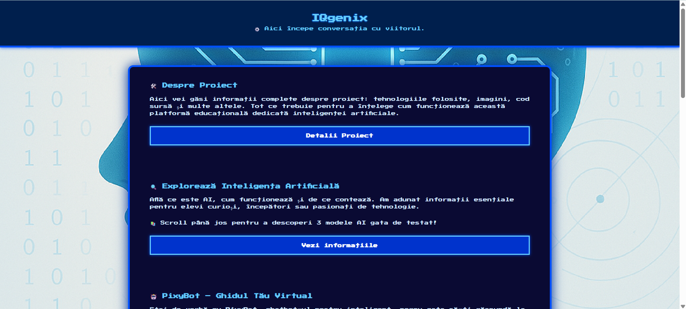
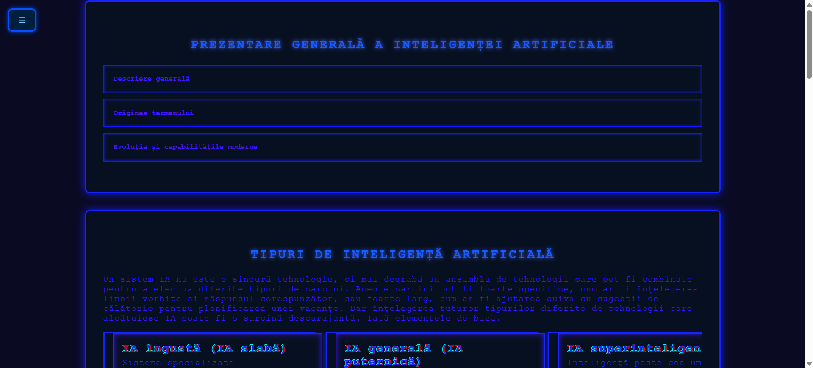
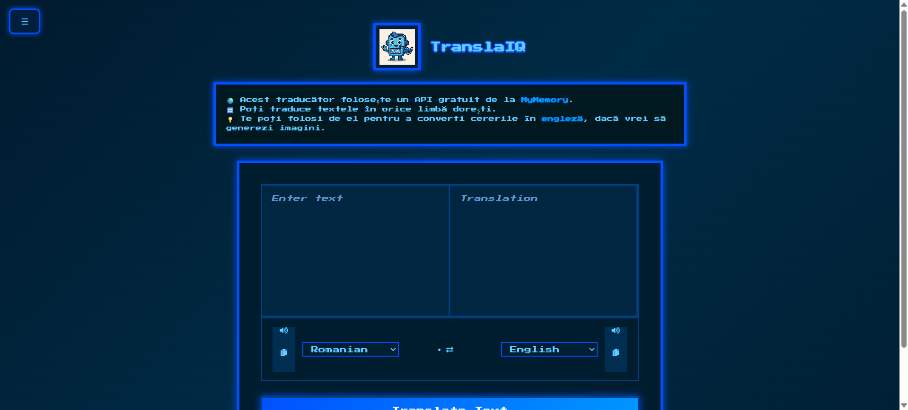
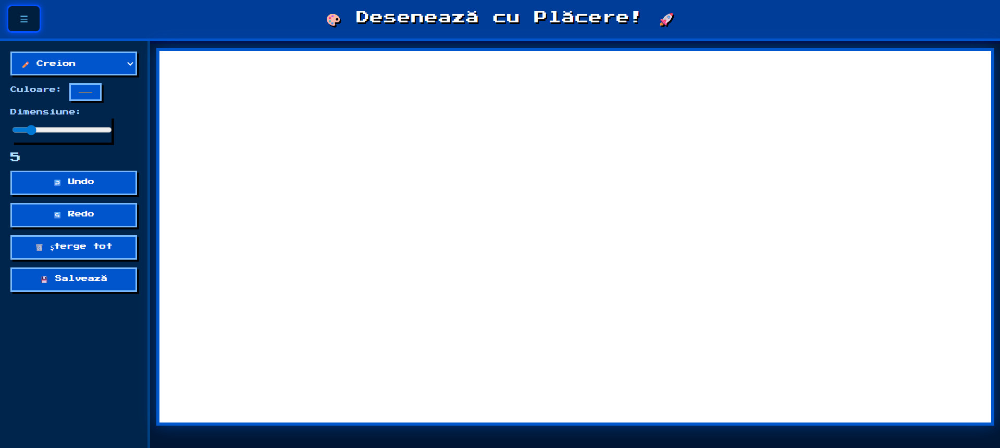
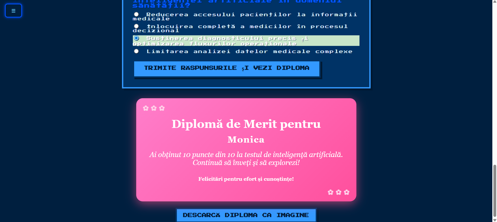

# IQgenix

## Realizator Proiect
**Nume:** Păun Monica Georgiana  
**Clasa:** a X-a  
**Instituție:** Colegiul Național „Tudor Vladimirescu” din București  
**Profesor coordonator:** Măreș Mădălina

---

## Descriere
Acest proiect este o platformă interactivă care combină inteligența artificială în trei funcționalități principale: un chatbot AI, un traducător automat și un generator de imagini pe baza cererilor textuale. Fiecare modul este creat pentru a oferi utilizatorului o experiență educațională și practică legată de noile tehnologii AI.

Ideea acestui site este **100% originală** și a fost creată pentru a oferi o platformă educațională interactivă despre inteligența artificială și tehnologiile digitale. Deși conceptele și structura generală sunt originale, unele componente tehnice, precum chatbotul, traducătorul și generatorul de imagini, au fost dezvoltate pornind de la tutoriale disponibile public pe YouTube. Acestea au fost însă adaptate și personalizate în mod semnificativ pentru a se potrivi nevoilor proiectului și pentru a crea o experiență unică pentru utilizatori.

Acest proiect este publicat online și poate fi accesat la următoarea adresă:  
[https://iqgenix.netlify.app](https://iqgenix.netlify.app)

---

## Funcționalități AI principale

1. **Chatbot AI**  
Implementat folosind modelul Gemini 2.0 Flash (Google AI). Răspunde la întrebări în limbaj natural și poate susține o conversație logică cu utilizatorul. Interfața și funcționalitatea au fost adaptate pentru a răspunde rapid și clar în cadrul site-ului.

2. **Traducător AI**  
Bazat pe API-ul MyMemory, permite traducerea textului introdus de utilizator dintr-o limbă în alta (ex: română ⇄ engleză). Detectează automat limba de pornire și oferă răspunsul în timp real. Interfața este personalizată pentru a fi cât mai intuitivă.

3. **Generator de imagini AI**  
Utilizează platforma Vyro.ai, care generează imagini realiste pornind de la descrieri textuale date de utilizator. Serviciul este integrat într-un modul web care oferă feedback rapid și afișează rezultatul direct pe site.

Toate componentele AI sunt integrate într-o platformă unificată pentru a crea o experiență interactivă și educațională.

---

## Funcționalități suplimentare

- Poveste interactivă cu robotul **Intellix**, care ia decizii într-un oraș inteligent al viitorului, stimulând memoria, imaginația și exprimarea utilizatorilor.
- Pagina de desen digital în stil „paint”, unde utilizatorii pot crea liber și pot experimenta cu arta digitală.

---

## Tehnologii Folosite

- **HTML5** și **CSS3** pentru structură și design vizual.
- **JavaScript** pentru interactivitate și logică în browser.
- API-uri externe: **Gemini 2.0 Flash de la Google** (chatbot), **MyMemory** (traduceri), **Vyro.ai** (generare imagini).
- **Google Forms** pentru gestionarea contactului cu utilizatorii.

---

## Cerințe de Sistem

Pentru a utiliza această platformă, este suficient un dispozitiv cu un browser modern (Chrome, Firefox, Edge, Safari). Nu sunt necesare instalări suplimentare. Accesul la internet este obligatoriu pentru interacțiunea cu API-urile externe.

---

## Public Țintă

Proiectul este destinat studenților, pasionaților de tehnologie și oricui dorește să învețe despre inteligența artificială printr-o experiență practică și interactivă. Poate servi și ca instrument educațional pentru mediul academic sau auto-învățare.

---

## Prezentare Vizuală

### Pagina Principală  

### Pagina de Informații  

### Traducător AI  

### Modul Paint Interactiv  

### Quiz și Diplomă AI  

